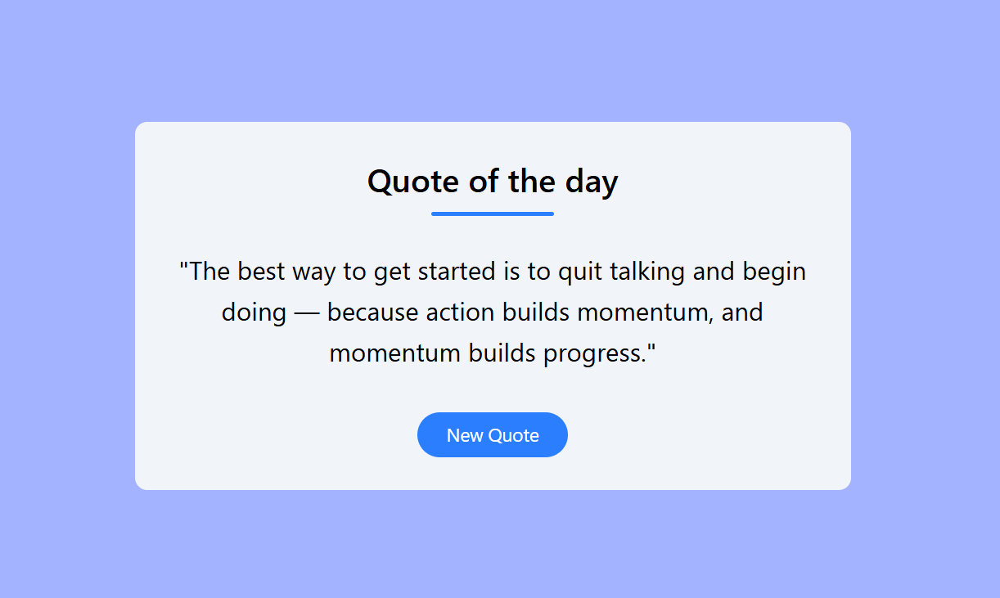

# Node.js Fullstack Practice Projects 🚀

Welcome to my **Node.js Fullstack Practice Repo**! This repository contains a series of full-stack projects where I'm learning and implementing how frontend and backend work together using:

- **Frontend**: React + Vite + Tailwind CSS  
- **Backend**: Node.js + Express  
- **Deployment**: Vercel (Frontend), Render (Backend)

---

## 🎯 Aim of This Repository

The goal of this repository is to:

- Practice building **real-world full-stack applications**
- Strengthen my understanding of how to create and consume **custom APIs**
- Learn how to **connect React with backend services**
- Practice **project structuring**, clean code, and **deployment**

Each project will be stored in a separate folder within this repo.

---

## 📌 Project 1: Quote Generator App

### 💡 Overview

A motivational **Quote Generator** where users can click a button to get a new quote.  
The quotes are served from a custom-built **Express API**, and displayed in a responsive UI built using **React + Tailwind CSS**.

---

### ⚙️ Tech Stack

- **Frontend**: React (with Vite) + Tailwind CSS
- **Backend**: Node.js + Express
- **Deployment**:
  - **Frontend** → Vercel
  - **Backend** → Render

---

### 📸 Screenshot

---

### 🌐 Live Demo

- 🔗 Frontend: [Quote-app](https://nodejs-fullstack-practice.vercel.app/)
- 🔗 Backend API: [API call](https://nodejs-fullstack-practice.onrender.com/api/quote)

---

### 🛠 How to Run It Locally

Check out the **frontend [Quote-app README file here](./quote-app/frontend/README.md)** to learn how to install and run both backend and frontend locally.

---

## 📌 Project 2: Notes App 📝

### 💡 Overview

A **Notes App** where users can create, update, delete, and manage text notes.  
Each note includes a title, content, and timestamp. Notes are stored in the backend and rendered dynamically in the frontend.

---

### ⚙️ Tech Stack

- **Frontend**: React (with Vite) + Tailwind CSS  
- **Backend**: Node.js + Express  
- **Deployment**:
  - **Frontend** → Vercel  
  - **Backend** → Render

---

### 📸 Screenshot

---

### 🌐 Live Demo

- 🔗 Frontend: [Notes App Frontend](https://notes-app-chi-khaki.vercel.app/)
- 🔗 Backend API: [Notes API](https://notes-app-ftxv.onrender.com/api/notes)

---

### 🛠 How to Run It Locally

Check out the **frontend [Notes-app README file here](./notes-app/frontend/README.md)** to learn how to install and run both backend and frontend locally.

---

## 📌 Project 3: Contact Form ✉️

### 💡 Overview

A responsive **contact form** that allows users to send messages directly from the frontend. The data is saved in **MongoDB** via a custom **Node.js + Express API.**
Form includes basic validations, toast notifications for success/failure, and is fully mobile-friendly.

---

### ⚙️ Tech Stack

- **Frontend**: React (with Vite) + Tailwind CSS  
- **Backend**: Node.js + Express + MongoDB
- **Toast Notifications**: React-Toastify

---

### 📸 Screenshot

---

### 🛠 How to Run It Locally

Check out the **frontend [Contact-form README file here](./contact-form/frontend/README.md)** to learn how to install and run both backend and frontend locally.

---

Feel free to ⭐️ this repo if you find it useful or inspiring!
